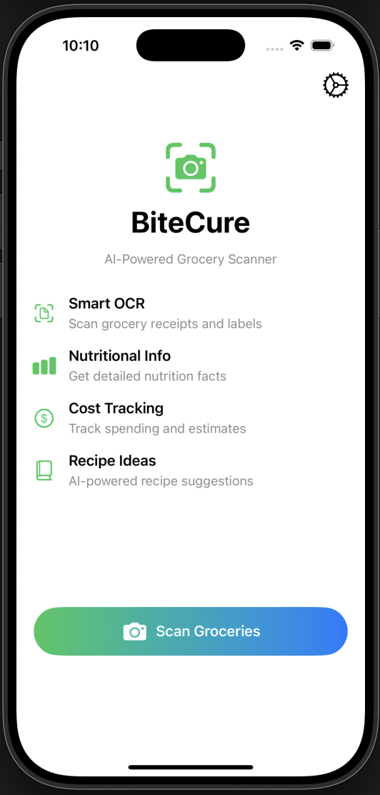
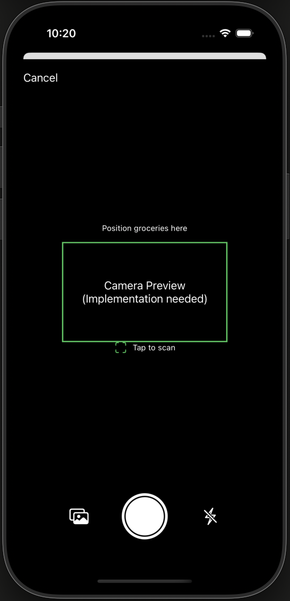

# BiteCure 🍎📱

**AI-Powered Grocery Scanner for iOS**

BiteCure is an innovative iOS app that transforms grocery shopping with cutting-edge AI technology. Simply snap a photo of your groceries, receipts, or food labels, and get instant nutritional information, cost estimates, and personalized recipe suggestions.

## ✨ Features

### 🔍 **Smart OCR Scanning**

- Advanced text recognition using Apple's VisionKit framework
- Intelligent grocery item detection from photos and receipts
- Support for both camera capture and photo library images
- Real-time processing with visual feedback

### 🤖 **AI-Powered Analysis**

- OpenAI GPT integration for intelligent food analysis
- Automatic nutritional information extraction
- Cost estimation with regional price awareness
- Dietary restriction and allergy consideration

### 📊 **Comprehensive Results**

- **Items Tab**: Detected groceries with confidence scores and costs
- **Nutrition Tab**: Detailed nutritional breakdown and health insights
- **Recipes Tab**: AI-generated recipe suggestions using your items
- Interactive tabbed interface for easy navigation

### ⚙️ **Personalized Settings**

- OpenAI API key configuration
- Dietary preferences (vegetarian, vegan, keto, gluten-free, etc.)
- Allergy management and restrictions
- Currency and location preferences
- Notification settings for recipes and deals

### 💾 **Data Management**

- Local storage of scan history
- Export functionality for your data
- Privacy-focused design with secure API key storage

## 🛠️ Tech Stack

- **SwiftUI** - Modern, declarative UI framework
- **VisionKit** - Apple's OCR and text recognition
- **Vision Framework** - Advanced image processing
- **OpenAI API** - GPT-powered intelligent analysis
- **UserDefaults** - Local settings persistence
- **Combine** - Reactive programming for data flow

## 🚀 Quick Start

### Prerequisites

- iOS 14.0+ / macOS 11.0+
- Xcode 12.0+
- Swift 5.3+
- OpenAI API key (optional - app works with mock data)

### Installation

1. **Clone the repository**

   ```bash
   git clone https://github.com/yourusername/BiteCure.git
   cd BiteCure
   ```

2. **Open in Xcode**

   ```bash
   open BiteCure.xcodeproj
   ```

3. **Build and run**
   - Select your target device/simulator
   - Press `Cmd + R` to build and run

### 🔑 API Configuration

1. **Get OpenAI API Key**

   - Visit [OpenAI Platform](https://platform.openai.com/)
   - Create an account and generate an API key
   - Copy your API key

2. **Configure in App**
   - Launch BiteCure
   - Tap the settings gear (⚙️) in the top right
   - Navigate to "AI Integration"
   - Enter your OpenAI API key
   - Save settings

> **Note**: The app works perfectly with mock data if no API key is provided, making it great for demos and testing.

## 📱 Usage Guide

### Basic Workflow

1. **Launch the App**

   - See the beautiful main interface with feature overview
   - Tap "Scan Groceries" to start

2. **Scan Items**

   - Position groceries within the camera viewfinder
   - Tap capture button or select from photo library
   - Watch the AI processing animation

3. **View Results**

   - Browse detected items with confidence scores
   - Check nutritional analysis and health insights
   - Explore AI-generated recipe suggestions
   - Save items to your history

4. **Customize Experience**
   - Set dietary preferences in Settings
   - Configure notifications for recipes and deals
   - Manage your scan history

### Advanced Features

- **Barcode Scanning**: Fallback support for product barcodes
- **Dietary Filters**: Automatic recipe filtering based on preferences
- **Cost Tracking**: Regional price estimation and spending analysis
- **Recipe Integration**: Detailed cooking instructions and ingredient lists

## 🎨 Screenshots

| Home Screen                   | Camera View                       | Results                             |
| ----------------------------- | --------------------------------- | ----------------------------------- |
|  |  |  |

_Screenshots coming soon - build and run the app to see the beautiful interface!_


